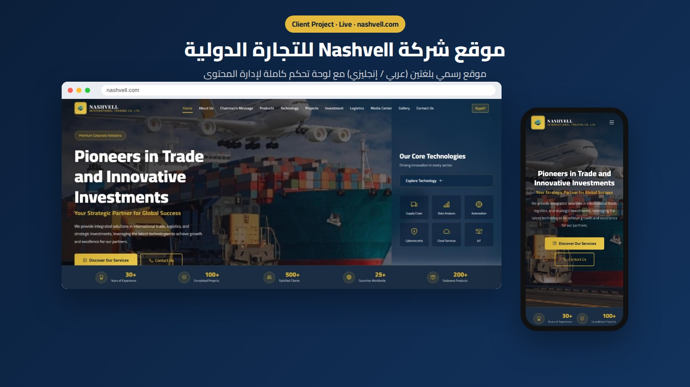
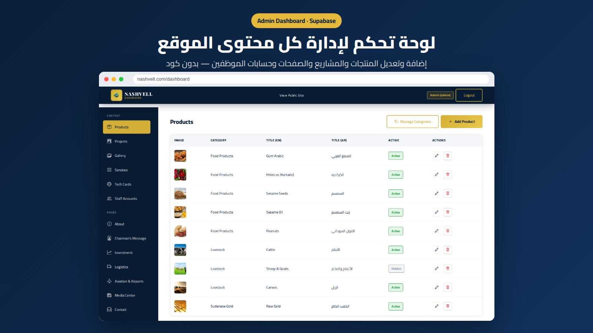

# Nashvell International Trading

A corporate website for Nashvell International Trading Co. Ltd., a company connecting Sudan to the world through trade, technology and investment.

**Live site:** https://www.nashvell.com

## Screenshots

## Features

- Multi-page company site: about, products, services, projects, investment, logistics, aviation, technology, media, gallery and contact
- Content-driven pages: each section reads its content from a data file through a loader script, so content can be updated without touching the markup
- Admin login and dashboard for managing site content
- Supabase backend and an EmailJS-powered contact form
- Remote maintenance mode: a flag in Supabase switches the whole site to a "temporarily unavailable" notice without a redeploy (`runtime-check.js`)
- SEO basics: `sitemap.xml` and `robots.txt`

## Tech Stack

HTML5, CSS3, vanilla JavaScript, Supabase, EmailJS, GitHub Pages.

## Run Locally

Serve the folder with any static server (for example `npx serve .`) and open `index.html`.

## Author

**Salman Tawfiq** - .NET / Full-Stack Developer, Riyadh, Saudi Arabia
[LinkedIn](https://www.linkedin.com/in/salmantawfiq) | [Portfolio](https://salmantawfiq.com)
